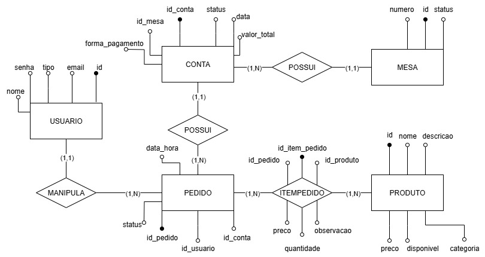

# APIs do Sistema de Controle de Pedidos 

**Base URL (primeiro servidor):** `http://localhost:8082/sistema-controle-pedidos`

## Sobre o Projeto

O projeto consiste no desenvolvimento de um sistema intuitivo para o controle e gerenciamento de pedidos, visando otimizar a produtividade e a qualidade do serviço em estabelecimentos gastronômicos. A plataforma centraliza a comunicação entre o salão e a cozinha, evitando erros e agilizando todo o processo operacional.

O sistema é estruturado em três perfis de acesso distintos e hierárquicos:

Gerente: Gerencia os usuários e suas permissões no sistema.

Garçom: Anota os pedidos na mesa pelo celular/tablet e os envia para a cozinha.

Cozinha: Recebe os pedidos, atualiza o andamento do preparo e avisa o garçom quando o prato está pronto ou se há algum problema.

## Visão Geral
Aplicação Spring Boot para gerenciamento de mesas, contas, produtos e pedidos em um restaurante/cafeteria. Configurações importantes (em application.properties):

spring.application.name = sistema-controle-pedidos
server.port = 8082
server.servlet.context-path = /sistema-controle-pedidos
spring.datasource.url = jdbc:postgresql://localhost:5432/controlepedidos
jwt.secret = definido
jwt.expiration = 3600000 (ms) -> 1h

## Diagrama ER

